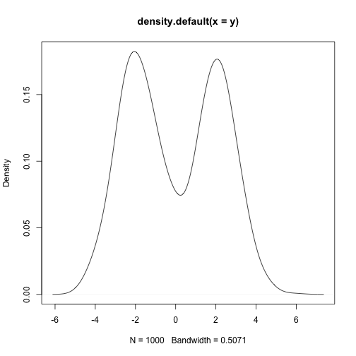
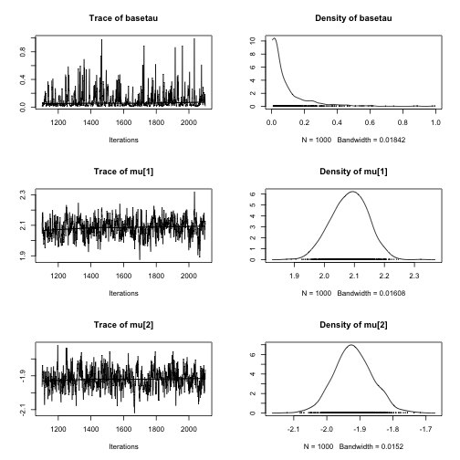



Show How to Make Reproducible Homework with Knitr and Jags
==========

In order to use `Jags` and `R` to do the samething as `Winbugs`, we need **2** files in total: the model file `model.bug` and the R code file, say `jags.R`.

# Model.bug #

First put the same code in `model.bug` file as you did in `Winbugs`, for example:

```
model {
	for (i in 1:M) {
		y[i] ~ dnorm(mu[z[i]], tauinv[z[i]])
		z[i] ~ dcat(p[])
	}
	# stick-breaking prior
	p[1] <- r[1]
	for (j in 2:(N-1)) {p[j] <- r[j]*(1-r[j-1])*p[j-1]/r[j-1]}
	for (k in 1:(N-1)) {r[k] ~ dbeta(1, alpha)}
	#  sum p
	ps <- sum(p[1:(N-1)])
	p[N] <- 1 - ps
	# baseline
	for (k in 1:N) {
	    mu[k] ~ dnorm(basemu, basetau)
	    tauinv[k] ~ dgamma(3, b)
	}
	basemu ~ dnorm(0, .01)	
	basetau <- pow(sigmaF0, -2)
	sigmaF0 ~ dunif(0, 10)
	b ~ dgamma(0.03, 0.03)
	# DPP parameter prior
	alpha ~ dunif(0.3, 10)
	# alpha  <- 1
}
```

# Jags.R #

In R code file `Jags.R`, we put other stuff which uses R, say those simulated data, and posterior summary output, and other analysis too. 

First 

```r
library("rjags")
```


To simulate data:


```r
rMN3 <- function(n) {
    posneg <- rbinom(n, 1, 0.5)
    (1 - posneg) * rnorm(n, -2, 1) + posneg * rnorm(n, 2, 1)
}
M <- 1000
y <- rMN3(M)
```


We can also place plot here to see what data looks like:


```r
plot(density(y))
```

 


Then to call `Jags` to sample the posterior following our previous `model.bug` model:


```r
data2 <- list(M = M, y = y, N = 2)
jags2 <- jags.model("~/tmp/example1.bug", data = data2, n.chains = 1, n.adapt = 100)
update(jags2, 1000)
output2 <- coda.samples(model = jags2, variable.names = c("mu", "basetau"), 
    n.iter = 1000, thin = 1)
```


where our 1000 posterior samples are saved in `output2` with interested parameters, which can be analyzed later


```r
print(summary(output2))
```

```
## 
## Iterations = 1101:2100
## Thinning interval = 1 
## Number of chains = 1 
## Sample size per chain = 1000 
## 
## 1. Empirical mean and standard deviation for each variable,
##    plus standard error of the mean:
## 
##            Mean     SD Naive SE Time-series SE
## basetau  0.0983 0.1271  0.00402        0.00607
## mu[1]    2.0837 0.0604  0.00191        0.00392
## mu[2]   -1.9195 0.0581  0.00184        0.00389
## 
## 2. Quantiles for each variable:
## 
##            2.5%     25%     50%    75%  97.5%
## basetau  0.0111  0.0226  0.0495  0.115  0.461
## mu[1]    1.9652  2.0428  2.0865  2.126  2.198
## mu[2]   -2.0309 -1.9584 -1.9210 -1.882 -1.808
```

```r
plot(output2)
```

 


